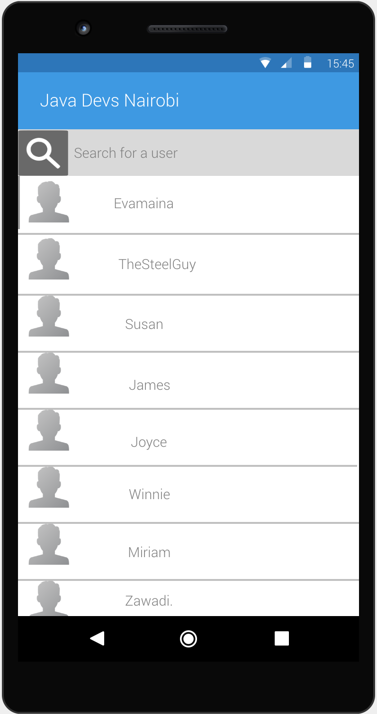
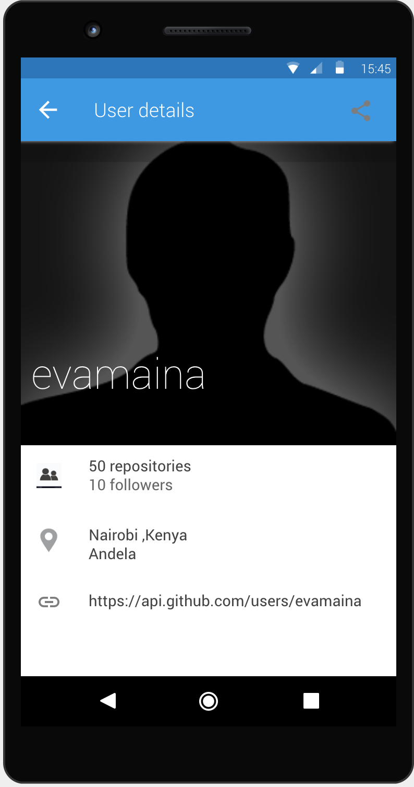
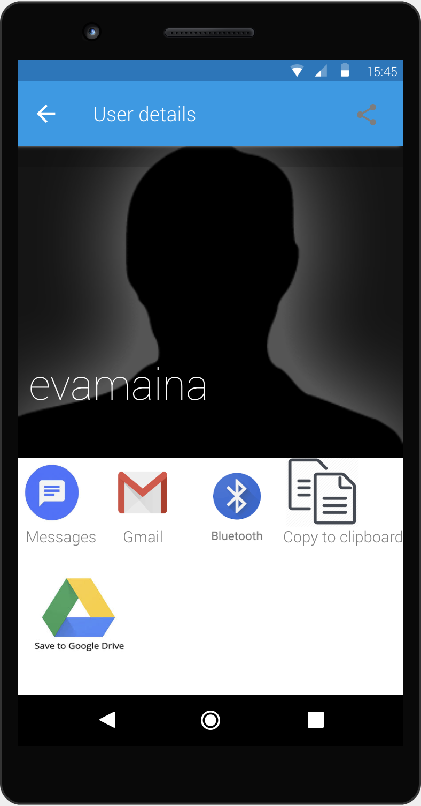

# JavaDevsNairobi
This is an application to list all the Java Developers in Nairobi as provided by the GitHub API.

## Getting Started

To run this app on your machine, ensure that you have Android Studio installed, then follow the steps below to get it working.

- Clone this repository on your machine with the command `git clone https://github.com/evamaina/JavaDevsNairobi.git`.
- Start your Android Studio and navigate to the folder where you cloned the project.
- cd to `JavaDevsNairobi`
- On your android studio select app then run the app.Use either an emulator or on an actual device.

## Running the tests

- To run tests and generate code coverage report, just run the following command on your terminal `./gradlew clean jacocoTestReport`.
- Then you can navigate to the directory `app/build/reports/coverage/debug/` and open the `index.html` file on your browser to see the coverage report.

## Demo
The final app looks as shown below:

# Screenshots for Mockups:

The mockups below are created using the Justinmind wire-framing tool. I chose to use this tool because:
* It allows me as a designer to create both low- and high-fidelity prototypes, and I'm able to get pretty
  in depth with prototyping interactions as well.
* It seems really straightforward to set up designs as mockups.It is the easiest prototyping program to use and learn.
* User Interface is great and you can easily create an interactive prototype of your app
* I like the intuitive way the software presents its resources, in particular, the graphics resources, on the left sidebar.
* It offers capabilities typically found in diagramming tools like drag and drop placement, re-sizing, formatting and export/import of widgets.

# JavaDevsNairobi-Kotlin
